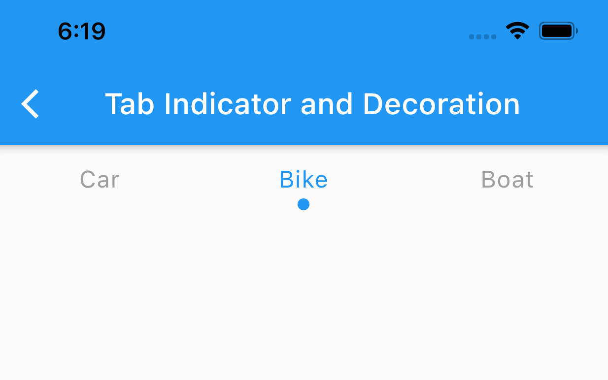
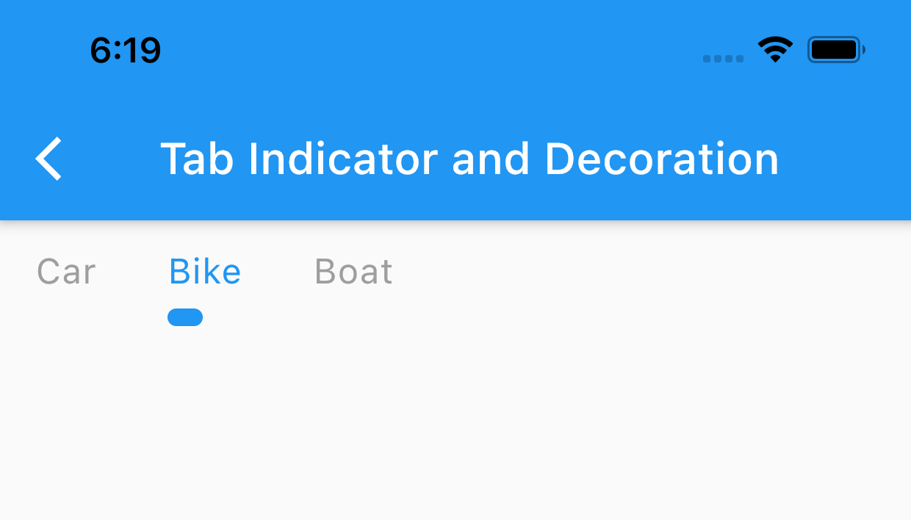
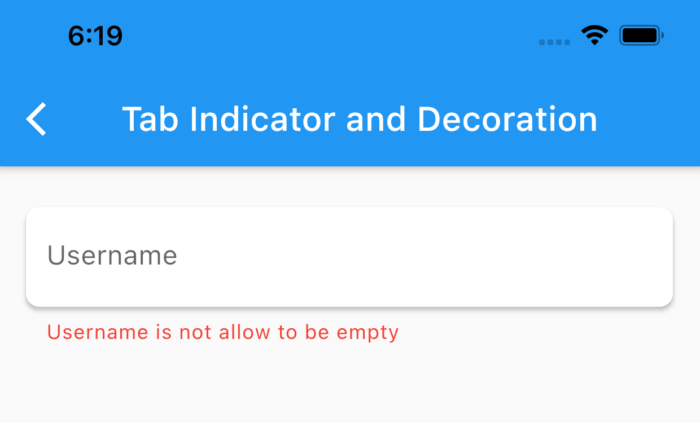

# skadi

[](https://pub.dev/packages/skadi) 

Flutter utilities packages for custom widgets and utilities function.

# Installation

Add this to pubspec.yaml

```dart
dependencies:
  skadi: ^4.3.2
```

# Widgets

| Widget                             | Description                                                                 |
| ---------------------------------- | --------------------------------------------------------------------------- |
| [ConditionalWidget][other]         | Build a widget based on a condition                                         |
| [CircularLoading][other]           | Loading widget                                                              |
| [Dot][other]                       | Create a customizable Dot or bullet point                                   |
| [EllipsisText][other]              | Nullable Text with ellipsis as default overflow                             |
| [KeyboardDismiss][other]           | Dismiss keyboard on tap                                                     |
| [LoadingOverlay][controls]         | Create an overlay loading that cover entire screen and disable input        |
| [LoadingOverlayPopScope][controls] | prevent or allow user from pop the screen when LoadingOverlay is displaying |
| [ReadMoreText][other]              | Read more or read less text                                                 |
| [SkadiAccordion][controls]         | Custom ExpansionTile                                                        |
| [SkadiActionSheet][dialog]         | Custom CupertinoActionSheet for option selector                             |
| [SkadiAsyncButton][buttons]        | Custom ElevatedButton for asynchronous onPressed callback                   |
| [SkadiAsyncIconButton][buttons]    | SkadiIconButton with asynchronous onPressed callback                        |
| [SkadiBadge][other]                | Small badge like notification                                               |
| [SkadiConfirmationDialog][dialog]  | Platform adaptive AlertDialog with cancel and confirm action                |
| [SkadiFutureHandler][other]        | FutureBuilder with less boilerplate code                                    |
| [SkadiIconButton][buttons]         | Customizable IconButton                                                     |
| [SkadiLoadingButton][buttons]      | Custom ElevatedButton with loading notifier                                 |
| [SkadiPaginatedGridView][other]    | GridView with pagination support                                            |
| [SkadiPaginatedListView][other]    | ListView with pagination support                                            |
| [SkadiPlatformChecker][other]      | Platform adaptive widget                                                    |
| [SkadiProvider][main]              | A provider for Skadi global setting                                         |
| [SkadiSimpleDialog][dialog]        | Simple platform adaptive AlertDialog                                        |
| [SkadiStreamHandler][other]        | A StreamBuilder with less boilerplate code                                  |
| [SpaceX][other]                    | SizedBox with only width                                                    |
| [SpaceY][other]                    | SizedBox with only height                                                   |
| [ValueNotifierWrapper][other]      | Wrapper with ValueNotifier when using StatelessWidget                       |
| [WidgetDisposer][other]            | Provide a dispose callback when using StatelessWidget                       |

[buttons]: https://github.com/lynical-software/skadi/tree/master/example/lib/examples/buttons.dart
[controls]: https://github.com/lynical-software/skadi/tree/master/example/lib/examples/controls.dart
[other]: https://github.com/lynical-software/skadi/tree/master/example/lib/examples/other_widget.dart
[dialog]: https://github.com/lynical-software/skadi/tree/master/example/lib/examples/dialogs.dart
[main]: https://github.com/lynical-software/skadi/tree/master/example/lib/main.dart

# Mixin

### AfterBuildMixin

Create an override method that will call after the build method has been called

```dart
class _HomePageState extends State<NewPage> with AfterBuildMixin {

  //this method will call after widget has been build
  @override
  void afterBuild(BuildContext context) {

  }

  @override
  Widget build(BuildContext context) {
    return Container();
  }
}

```

### SkadiFormMixin

Provide some property and method when working with `Form`

#### field and attribute

- `formKey`: a key for form
- `loadingNotifier`: a bool ValueNotifier
- `passwordObscureNotifier`: a bool ValueNotifier for toggling password obscure field
- `isFormValidated`: a bool return by validate `formKey`

#### method

- `toggleLoading`: toggle `loadingNotifier` value
- `togglePasswordObscure`: toggle `passwordObscureNotifier` value
- `PasswordTextFieldBuilder`: create a Password TextField

```dart
class _HomePageState extends State<NewPage> with SkadiFormMixin {
  @override
  Widget build(BuildContext context) {
    return Scaffold(
      body: Form(key: formKey, child: child)
    );
  }
}
```

### DeferDispose

A mixin that can create an auto dispose ChangeNotifier base class

```dart
class _HomePageState extends State<NewPage> with DeferDispose {

  late ValueNotifier<int> notifier = createDefer(()=> ValueNotifier(2));

  @override
  Widget build(BuildContext context) {
    return Container();
  }
}
```

# Extension

### BuildContext extension

```dart
  Size screenSize = context.screenSize;
  Color primaryColor = context.primaryColor;
  Color accentColor = context.accentColor;
  TextThemeData textTheme = context.textTheme;
  Theme theme = context.theme;
  MediaQueryData data = context.mediaQuery;
  double keyboardHeight = context.keyboardHeight;
  context.hideKeyboard();

```

context extension also support method from [SkadiNavigator](#skadinavigator)

### TextStyle Extension

````dart
Text("Hello Flutter", style: TextStyle().normal)
Text("Hello Flutter", style: TextStyle().medium)
Text("Hello Flutter", style: TextStyle().bold)
Text("Hello Flutter", style: TextStyle().semiBold)
Text("Hello Flutter", style: TextStyle().white)
Text("Hello Flutter", style: TextStyle().black)
Text("Hello Flutter", style: TextStyle().red)
Text("Hello Flutter", style: TextStyle().green)
Text("Hello Flutter", style: TextStyle().grey)
Text("Hello Flutter", style: TextStyle().underline)
Text("Hello Flutter", style: TextStyle().setColor(Colors.white))
Text("Hello Flutter", style: TextStyle().setFontSize(24))


### DateTime extension

```dart
DateTime.now().format(format: "dd mmm yyyy", locale: context.locale)
DateTime.now().isTheSameDay(DateTime.now())
DateTime.now().formatToLocalDate(format: "dd mmm yyyy", locale: context.locale)
````

### List and map extension

```dart
///Filter list
List<int> adult = [2,24,12,18].filter((age)=> age >= 18);

///Just find and return
int? eighteen = adult.findOne((age)=> age == 18);

///Find where age == 2 and update it to +2
adult.update((age)=> age == 2, (age) => age + 2 );

///Add age to Map if age isn't null
Map<String, int> data = {};
int? age = 20;
data.addIfNotNull("age",age);

///Return null if age doesn't exist
data.getIfExist("age");
```

### Widget's Extension

```dart
Text("Hello Flutter").padding(EdgeInsets.all(16.0)) // default value is EdgeInsets.all(8.0)
Text("Hello Flutter").margin(EdgeInsets.all(16.0)) // default value is EdgeInsets.all(8.0)
///As a value
Text("Hello Flutter").marginValue(all: 12)
Text("Hello Flutter").paddingValue(horizontal: 12, vertical: 8)
```

```dart
Text("Hello Flutter").cssSpacing(margin: [10,10], padding:[16])
//css margin and padding rule
```

```dart
Text("Hello Flutter").rotate(45)
///Rotate 45 degree
```

```dart
Text("Hello Flutter").flexible
Text("Hello Flutter").expanded
Text("Hello Flutter").clipOval
Text("Hello Flutter").opacity(0.5)
```

### String extension

```dart
String? name = "chunlee".capitalize; // => Chunlee
bool empty = name.isNullOrEmpty;
```

### ValueListenable extension

```dart
ValueNotifier<int> notifier = ValueNotifier(2);

@override
Widget build(BuildContext context) {
  return notifier.listen((value){
      return Text("${value}");
    }
  );
}

```

# Utility and Style

### DotTabIndicator



```dart
  TabBar(
      ...
      indicator: DotTabIndicator(
        color: Colors.blue,
        dotAlignment: TabAlignment.bottom,
      )
      ...
  )
```

### SmallUnderlineTabIndicator



```dart
  TabBar(
      ...
      isScrollable: true, //This indicator work best with scrollable tab bar
      indicator: SmallUnderlineTabIndicator(
        color: Colors.blue,
        paddingLeft: 16,
        alignment: TabAlignment.bottom,
      )
      ...
  )
```

### ShadowInputBorder

This input border solve a problem that TextField doesn't have a default elevation.



```dart
  TextFormField(
      ...
      decoration: InputDecoration(
        border: ShadowInputBorder(
          elevation: 2.0, //required
          fillColor: Colors.white, //required
          shadowColor: Colors.black87,
        ),

      )
      ...
  )
```

### SkadiNavigator

More efficient way to use Navigator with less boilerplate. Use the same method name as Navigator class

`routeName`: `name` argument for `RouteSetting`. You can still provide `RouteSetting` and this parameter will be ignore.

```dart
  SkadiNavigator.push(context, HomePage(), routeName: "home");
  SkadiNavigator.pushReplacement(context, HomePage(), routeName: "home");

  ///Push and remove all
  SkadiNavigator.pushAndRemove(
    context,
    HomePage(),
    routeName: "home",
    condition: (route) => false,
  );

  ///Pop until the first route
  SkadiNavigator.popAll(context);

  ///Pop X amount of time
  SkadiNavigator.popTime(context, 2);

  ///Return current routeName
  String? route = SkadiNavigator.currentRoute(context);

  ///SkadiRouteObserver is a route observer that support logging and analytic callback
  MaterialApp(
    debugShowCheckedModeBanner: false,
    navigatorObservers: [
      SkadiRouteObserver(log: true, analyticCallBack: (route) {}),
    ],
    home: HomePage(),
  )
```

### SkadiColor

```dart
  //create color from Hex String
  Color color = SkadiColor.fromHexString("FAFAFA");

  ///Convert Color to MaterialColor
  MaterialColor material = SkadiColor.toMaterial(color);

  //create color from RGB without Opacity
  Color rgb = SkadiColor.fromRGA(222,222,222);
```

### SkadiUtils

```dart

//Ping to google to check for internet connection
bool isConnected = await SkadiUtils.checkConnection();

//Convert degree to radian value
double radian = SkadiUtils.degreeToRadian(90);

//Future.delayed base on millisecond value
await SkadiUtils.wait(200);

//Get random image from unsplash
String carUrlImage =  SkadiUtils.unsplashImage(width: 200, height: 200, category: "car");

//Get byte from asset bundle
Future<Uint8List> imageByte = await SkadiUtils.getBytesFromAsset("image asset path", 200); //200 is an image width

//Get random image from unsplash
String carUrlImage =  SkadiUtils.unsplashImage(width: 200, height: 200, category: "car");

//Get random from picsum with provided: width and height
String randomUrlImage = SkadiUtils.picsumImage(200,300);
```

### SkadiResponsive

A responsive tool to help define a value base on screen size

- Wrap your Home widget in MaterialApp with **SkadiResponsiveBuilder**

Default breakpoint

```dart
SkadiResponsiveBreakpoint.defaultValue()
    : mobileSmall = 360, /// <360
      mobile = 480, /// from 361 -> 766
      tablet = 768, /// 768 -> 1023
      desktop = 1024; /// >=1024
```

There are 2 support method to define a value `SkadiResponsive.value` and `SkadiResponsive.auto`

Example:

```dart
// Only required first parameter
//set value 20 for `Mobile` size
//set value 24 for `Tablet` size
//set value 28 for `Desktop` size
//set value 16 for `Small mobile `size
//buildcontext is optional and if context isn't null, it will react to MediaQuery change
double width = SkadiResponsive.value(20, 24, 28, 16, context);


///Auto value base on provided rule
///-4 for `Small mobile`, +8 for `Tablet` and +16 for `Desktop` if using `SkadiResponsiveRule.add`
///-25% for `Small mobile`, x2 for `Tablet` and x3 for `Desktop` if using `SkadiResponsiveRule.multiply`
double width = SkadiResponsive.auto(20, SkadiResponsiveRule.add);


Widget child = SkadiResponsive.builder(
  mobile: () => MobileWidget(), ///required
  tablet: () => TabletWidget(), ///required
  desktop: () => DesktopWidget(), ///Optional, using `Tablet` widget if value is null
  mobileSmall: () => MobileSmallWidget(), ///Optional, using `Mobile` widget if value is null
);

```
